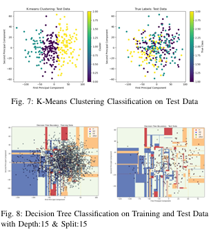

# CNN-Forest: Forest Health Classification Project

This project implements machine learning approaches for classifying forest health from aerial imagery, comparing classical ML methods (PCA + traditional classifiers) with deep learning (CNN with Inception modules).

## Project Overview

The system classifies forest regions into four health categories: H (Healthy), HD (High Damage), LD (Low Damage), and other.



## Architecture

### Data Pipeline

**Image Segmentation (Data Segementation.py)**: Processes raw aerial images with XML annotations, extracting bounding boxes and resizing to 100×100 pixels.

### Classical ML Pipeline

Four implementations using manual PCA for dimensionality reduction followed by different classifiers:

- **Decision Tree (PCA_Decision_tree.py)**: Uses max_depth=5, min_samples_split=5 for interpretable classification

- **K-Means Clustering (PCA_Kmean.py)**: Unsupervised approach with 3 clusters

- **Linear SVM (PCA_SVM_Softmargin_linear.py)**: Soft-margin linear classifier with C=1.0

- **RBF SVM (PCA_SVM_rbf.py)**: Non-linear SVM with radial basis function kernel

**Common Preprocessing:**

- Zero-variance pixel removal
- Z-score standardization with epsilon term
- Manual PCA via eigendecomposition

### Deep Learning Pipeline

**CNN with Inception Modules (CNN_inception_module.py, CNN_Hyper_parameter_tuning.py)**: Custom architecture with parallel convolutional branches for multi-scale feature extraction.

**Key Features:**

- Data augmentation (rotation, shift, zoom, flip)
- 50 epochs training with early stopping
- Model checkpointing for best validation performance
- Hyperparameter grid search over batch sizes and learning rates

**Visualization (CNN_Hyper_Parameter_tuning_heat_map.py)**: Generates heatmaps of validation loss across hyperparameter combinations.

## Installation
```bash
pip install opencv-python numpy matplotlib scikit-learn tensorflow pandas seaborn
```

## Usage

### Data Preparation
```bash
python "Data Segementation.py"
```

Processes images from `train_images/` and `train_annotations/` into `pca_train_health/` with class subdirectories.

### Classical ML
```bash
python PCA_Decision_tree.py  
python PCA_Kmean.py  
python PCA_SVM_Softmargin_linear.py  
python PCA_SVM_rbf.py
```

Each displays information retention plots, prints accuracy metrics, and visualizes decision boundaries.

### Deep Learning
```bash
python CNN_Hyper_parameter_tuning.py  # Grid search  
python CNN_inception_module.py         # Single model training  
python CNN_Hyper_Parameter_tuning_heat_map.py  # Visualize results
```

## Data Structure
```
data/  
├── Forest1/ or Forest2/  
│   ├── train_images/          # Raw aerial images  
│   ├── train_annotations/     # XML bounding boxes  
│   ├── pca_train_health/      # Processed training data  
│   │   ├── H/  
│   │   ├── HD/  
│   │   ├── LD/  
│   │   └── other/  
│   └── pca_test_health/       # Processed test data  
```

## Model Comparison

| Approach | Training Time | Interpretability | Dimensionality |
|----------|--------------|------------------|----------------|
| PCA + Classifiers | Seconds | High (visualizable) | 2-10 components |
| CNN | Hours (50 epochs) | Low (black-box) | High-dimensional |

## Visualization

- **Classical ML**: 2D decision boundaries in principal component space
- **K-Means**: Side-by-side cluster vs. true label comparison
- **CNN**: Validation loss heatmaps across hyperparameters

## Notes

- **Path Configuration**: All scripts use hardcoded Windows paths (`D:\MLME project\...`) that must be modified for your environment. The codebase references both Forest1 and Forest2 datasets.

- **Reproducibility**: Random seeds are set in most scripts (42 for Decision Tree/Linear SVM, 0 for K-Means) but not RBF SVM.

- **PCA Implementation**: Manual eigendecomposition is used for educational purposes rather than `sklearn.decomposition.PCA`.

## Co-Authors
- [Yogesh Rajesh](https://github.com/Yogesh7030) - Classical ML
